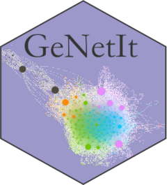

# GeNetIt (CRAN 0.1-6, development 0.1-7) 

GeNetIt is an R package for spatial graph-theoretic gravity modeling. The model framework is applicable for 
other types of matrix-based spatial flow (from-to) problems. Includes functions for constructing spatial graphs, 
sampling, summarizing associated raster variables and building unconstrained and singly constrained 
gravity models following Murphy et al., (2010). 

As of version 0.1-6 all support of raster (RasterLayer, RasterStack) and sp (SpatialPointsDataFrame) class objects  
has ended, replaced by terra (SpatRaster) and sf (sf POINT) classes.  

You can access a [full tutorial here](https://spatialr.s3.us-west-2.amazonaws.com/Gravity/GravityModel.html)

# Available functions in GeNetIt 0.1-6 are:

| `GeNetIt` Function           | Description                                                                             |
|:-----------------------------|:----------------------------------------------------------------------------------------|
| `adj.matrix`                 | Creates binary adjacency matrix of from-to (joins) structure of graph 
| `build.node.data`            | Build node data 
| `compare.models`             | Compare competing hypothesis (models)
| `dmatrix.df`                 | Distance matrix to data.frame
| `dps`                        | dps genetic distance matrix for Columbia spotted frog (Rana luteiventris)
| `flow`                       | Convert distance matrix to flow (1-d)
| `graph.metrics`              | Calculates a suite of metrics on the structure of the graph
| `graph.statistics`           | Raster statistics for edges (lines) with buffer argument for multi-scale assessment
| `gravity.es`                 | Effect size for a gravity model
| `gravity`                    | Gravity model
| `knn.graph`                  | K Nearest Neighbor or saturated Graph
| `node.statistics`            | Raster statistics for nodes (points)
| `plot.gravity`               | plot generic for a gravity model object
| `predict.gravity`            | predict generic gravity model
| `print.gravity`              | print generic gravity model
| `ralu.model`                 | Columbia spotted frog (Rana luteiventris) data for specifying gravity model. Note, the data.frame is already log transformed.
| `ralu.site`                  | Subset of site-level spatial point data for Columbia spotted frog (Rana luteiventris)
| `rasters`                    | Subset of raster data for Columbia spotted frog (Rana luteiventris)
| `summary.gravity`            | summary generic for gravity model objects
| `area.graph.statistics`      | Depreciated, please use graph.statistics with buffer argument
		
**Bugs**: Users are encouraged to report bugs here. Go to [issues](https://github.com/jeffreyevans/GeNetIt/issues) in the menu above, and press new issue to start a new bug report, documentation correction or feature request. You can direct questions to <jeffrey_evans@tnc.org>.

**To install `GeNetIt` in R use install.packages() to download curent stable release from CRAN** 

**or, for the development version, run the following (requires the remotes package):**
`remotes::install_github("jeffreyevans/GeNetIt")`
