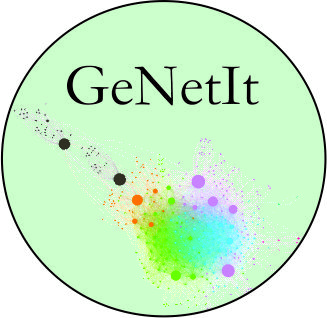

# GeNetIt (CRAN 0.1-3, development 0.1-4) 

GeNetIt R package for spatial graph-theoretic gravity modelling with implementation of spatial graph-theoretic genetic gravity models.
The model framework is applicable for other types of spatial flow questions. Includes functions for constructing spatial graphs, sampling and summarizing associated raster variables and building unconstrained and singly constrained gravity models.

# Available functions in GeNetIt 0.1-4 are:

| `spatialEco` Function        | Description                                                                             |
|:-----------------------------|:----------------------------------------------------------------------------------------|
| `area.graph.statistics`      | Depreciated, please use graph.statistics with buffer argument
| `build.node.data`            | Build node data 
| `compare.models`             | Compare competing hypothesis (models)
| `dmatrix.df`                 | Distance matrix to data.frame
| `dps`                        | dps genetic distance matrix for Columbia spotted frog (Rana luteiventris)
| `flow`                       | Convert distance matrix to flow (1-d)
| `graph.statistics`           | Raster statistics for edges (lines)
| `gravity.es`                 | Effect size for a gravity model
| `gravity`                    | Gravity model
| `knn.graph`                  | K Nearest Neighbor or saturated Graph
| `node.statistics`            | Raster statistics for nodes (points)
| `plot.gravity`               | plot generic for a gravity model object
| `predict.gravity`            | predict generic gravity model
| `print.gravity`              | print generic gravity model
| `ralu.model`                 | Columbia spotted frog (Rana luteiventris) data for specifying gravity model. Note, the data.frame is already log transformed.
| `ralu.site`                  | Subset of site-level spatial point data for Columbia spotted frog (Rana luteiventris)
| `rasters`                    | Subset of raster data for Columbia spotted frog (Rana luteiventris)
| `summary.gravity`            | summary generic for gravity model objects
		
**Bugs**: Users are encouraged to report bugs here. Go to [issues](https://github.com/jeffreyevans/GeNetIt/issues) in the menu above, and press new issue to start a new bug report, documentation correction or feature request. You can direct questions to <jeffrey_evans@tnc.org>.

**To install `GeNetIt` in R use install.packages() to download curent stable release from CRAN** 

**or, for the development version, run the following (requires the remotes package):**
`remotes::install_github("jeffreyevans/GeNetIt")`
